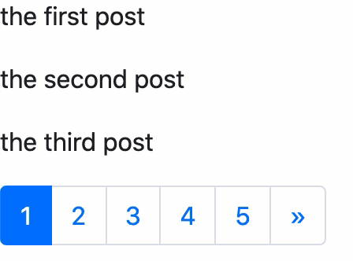

# Django_Pagination

[referred blog](https://narito.ninja/blog/detail/89/)



> ## models.py
``` python
from django.db import models

class Post(models.Model):
	title = models.CharField(max_length=200, unique=True)

	def __str__(self):
		return self.title
```

> ## admin.py
``` python
from django.contrib import admin
from .models import Post

admin.site.register(Post)
```

> ## views.py
``` python
from django.core.paginator import Paginator, EmptyPage, PageNotAnInteger
from django.shortcuts import render
from .models import Post
from django.views import generic

class PostIndex(generic.ListView):
    model = Post
    paginate_by = 3
```

> ## urls.py
``` python
from django.urls import path
from . import views

app_name = 'app'

urlpatterns = [
    path('', views.PostIndex.as_view(), name='post_list'), 
]
```

> ## post_list.html
``` python
<!DOCTYPE html>
<html>
<head>
    <meta charset="utf-8">
    <!-- <title></title> -->
    <meta name="viewport" content="width=device-width, initial-scale=1, shrink-to-fit=no">
    <link rel="stylesheet" href="https://stackpath.bootstrapcdn.com/bootstrap/4.4.1/css/bootstrap.min.css" integrity="sha384-Vkoo8x4CGsO3+Hhxv8T/Q5PaXtkKtu6ug5TOeNV6gBiFeWPGFN9MuhOf23Q9Ifjh" crossorigin="anonymous">
    
</head>

<body>
    
            <p>{{ post.title }}</p>
        

    

    <!-- JavaScript --> 
    <!-- jQuery first, then Popper.js, then Bootstrap JS -->
    <script src="https://code.jquery.com/jquery-3.4.1.slim.min.js" integrity="sha384-J6qa4849blE2+poT4WnyKhv5vZF5SrPo0iEjwBvKU7imGFAV0wwj1yYfoRSJoZ+n" crossorigin="anonymous"></script>
    <script src="https://cdn.jsdelivr.net/npm/popper.js@1.16.0/dist/umd/popper.min.js" integrity="sha384-Q6E9RHvbIyZFJoft+2mJbHaEWldlvI9IOYy5n3zV9zzTtmI3UksdQRVvoxMfooAo" crossorigin="anonymous"></script>
    <script src="https://stackpath.bootstrapcdn.com/bootstrap/4.4.1/js/bootstrap.min.js" integrity="sha384-wfSDF2E50Y2D1uUdj0O3uMBJnjuUD4Ih7YwaYd1iqfktj0Uod8GCExl3Og8ifwB6" crossorigin="anonymous"></script>

</body> 
</html>
```

> ## page.html
``` python

<body>
<!-- the simplest format -->

<!-- previous -->
<!--  -->
    <!-- <a href="?page={{ page_obj.previous_page_number }}">previous</a> -->
<!--  -->

<!-- current -->
<!-- {{ page_obj.number }}/{{ page_obj.paginator.num_pages }} -->

<!-- next -->
<!-- 
    <a href="?page={{ page_obj.next_page_number }}">next</a>
 -->


<!-- another version -->

<!-- previous -->
<!-- 
    <a href="?page={{ page_obj.previous_page_number }}">previous</a>
 -->

<!-- current -->
<!-- 
    
        <span>{{ num }}</span>
    
        <a href="?page={{ num }}">{{ num }}</a>
    
 -->

<!-- next -->
<!-- 
    <a href="?page={{ page_obj.next_page_number }}">次へ</a>
 -->


<!-- Bootstrap4 version-->

<ul class="pagination">
    <!-- previous -->
    
        <li class="page-item">
            <a class="page-link" href="?page={{ page_obj.previous_page_number }}">
                <span aria-hidden="true">&laquo;</span>
            </a>
        </li>
    

    <!-- current -->
    
        
            <li class="page-item active"><a class="page-link" href="#!">{{ num }}</a></li>
        
            <li class="page-item"><a class="page-link" href="?page={{ num }}">{{ num }}</a></li>
        
    

    <!-- next -->
    
        <li class="page-item">
            <a class="page-link" href="?page={{ page_obj.next_page_number }}">
                <span aria-hidden="true">&raquo;</span>
            </a>
        </li>
    
</ul>
```
